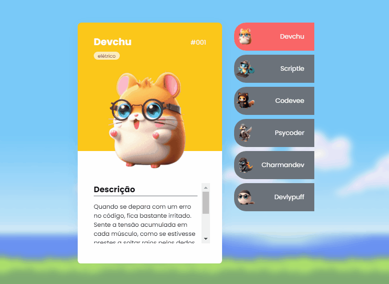

# Projeto PokeDev DevEmDobro

Projeto desenvolvido durante semana promovidade pelo DevEmDobro, onde foram criados cards com personagens inspirados em Pokemon, porém com poderes de desenvolvedores de software. 💻

[](https://danielaoliveiradsg.github.io/Pokedevs-Project/)

## Tecnologias Utilizadas
- HTML
- CSS
- JS

Clone o projeto
```
git clone <url>
```
Acesse a pasta
```
cd Pokedevs
```